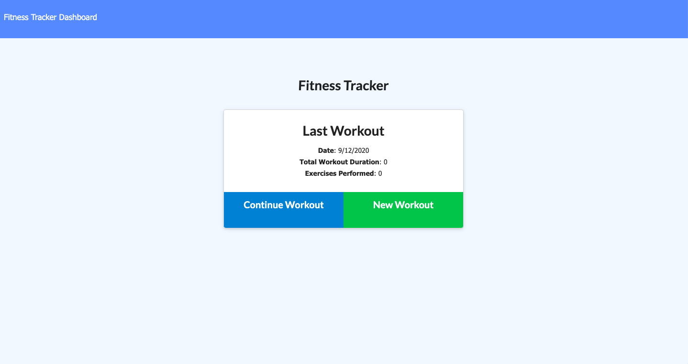
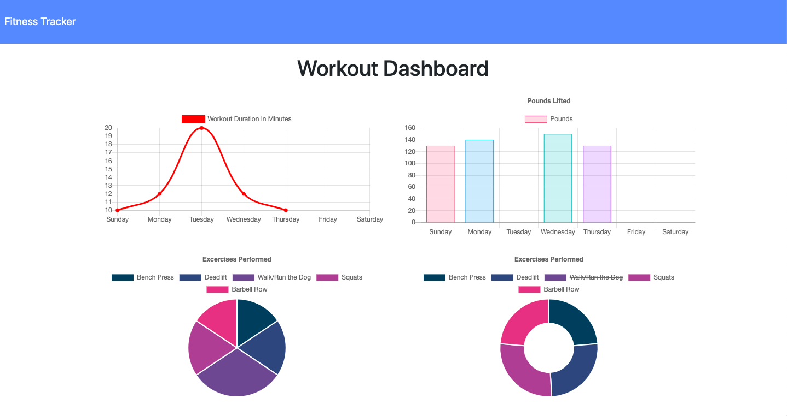

# Fitness Tracker

Home Page:

Dashboard/Stats Page:

## Description

A fitness application that allows you to keep track of your daily workouts. You can add and update exercises to a workout plan based on the type of exercise: resistance or cardio.

Resistance exercises include the name, type, weight(lbs), sets, reps, and duration(minutes). Cardio exercises include the name, distance(miles) and duration(minutes).

The combined weight of all your saved exercises is viewable on the dashboard page, as well as other stats

## Table of Contents

* [Installation](#Installation)
* [Usage](#Usage)
* [Questions](#Questions)
* [License](#License)

## Installation

Run 'npm install' in the terminal to install the necessary dependencies (express, mongoose, morgan) before using the application.

## Usage

Run 'npm start' in terminal and enter 'localhost:3000' in your web browser,

or click the Heroku link here: <https://secret-gorge-37389.herokuapp.com/>

## Questions

* Github: <https://github.com/andrewyen64>

* Email: andrewyen64@gmail.com

## License

MIT License

Copyright © 2020 Andrew Yen

[Link to License](LICENSE)
